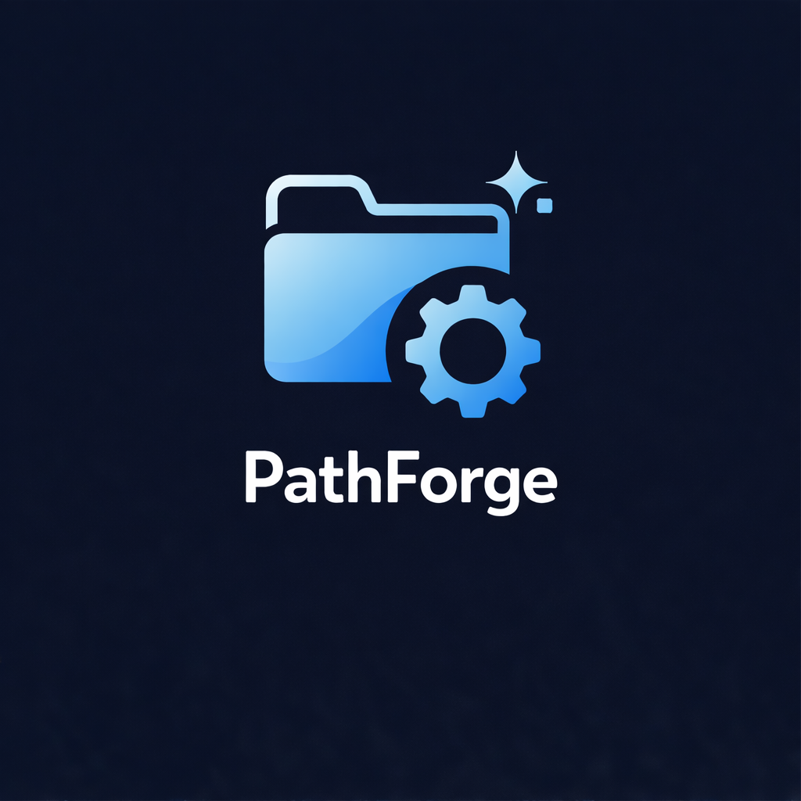

<!-- codex-branding:start -->
<p align="center"></p>

<p align="center">
  
  
  
</p>
<!-- codex-branding:end -->

# PathForge

**Windows Filesystem Repair & Deletion Suite**

A professional PowerShell GUI toolkit for filesystem repair, stubborn file deletion, permission management, and drive diagnostics. Features a modern dark-themed interface with comprehensive educational panels explaining the underlying Windows concepts.


---

## Features

### 🗑️ File Operations
- **Six Deletion Methods** — Progressive escalation from PowerShell to WMI, including long path and 8.3 short name techniques
- **Boot-Time Deletion** — Schedule stubborn files for removal on next restart via MoveFileEx API
- **Take Ownership** — Seize control of protected system files with one click
- **Permission Reset** — Restore inheritance and remove explicit deny entries
- **Orphaned SID Cleanup** — Identify and remove permissions for deleted accounts
- **Alternate Data Streams** — Scan and remove hidden NTFS streams (Zone.Identifier, etc.)
- **File Unblocking** — Remove "downloaded from internet" flags recursively

### 🔧 Filesystem Repair
- **CHKDSK Integration** — Online scan, offline repair, bad sector recovery, and spotfix modes
- **DISM RestoreHealth** — Repair Windows component store corruption
- **SFC Scannow** — System file integrity verification and repair
- **Full Repair Sequence** — Automated DISM → SFC → CHKDSK in optimal order
- **NTFS Self-Healing** — Enable, disable, or check background repair status
- **Dirty Bit Management** — Query and clear volume dirty flags

### 📊 Diagnostics
- **Drive Health Report** — Physical disk info, volumes, and partition layout
- **SMART Monitoring** — Failure prediction with critical attribute warnings
- **Reliability Counters** — Read/write errors, temperature, wear leveling
- **Event Log Analysis** — Surface disk-related warnings (Event IDs 55, 50, 98, 129, 153, 157)
- **TRIM Status** — Verify SSD optimization is enabled

### 📚 Educational Panels
Every major feature includes an expandable info panel explaining:
- What the operation does and why it works
- Equivalent command-line syntax
- Important warnings and edge cases
- Technical background (ACLs, NTFS internals, Windows APIs)

---

## Requirements

| Requirement | Details |
|-------------|---------|
| **OS** | Windows 10 / 11 / Server 2016+ |
| **PowerShell** | 5.1 or later (built into Windows) |
| **Privileges** | Administrator (auto-enforced) |
| **Dependencies** | None — uses native Windows components |

---

## Installation

### Option 1: Direct Download
```powershell
# Download and run
Invoke-WebRequest -Uri "https://raw.githubusercontent.com/SysAdminDoc/PathForge/refs/heads/main/PathForge.ps1"
& "$env:TEMP\PathForge.ps1"
```

### Option 3: Manual
1. Download `PathForge.ps1`
2. Right-click → **Run with PowerShell**
3. Accept the UAC prompt

> **Note:** If you encounter execution policy restrictions:
> ```powershell
> Set-ExecutionPolicy -ExecutionPolicy Bypass -Scope Process -Force
> .\PathForge.ps1
> ```

---

## Usage

### Quick Start
1. Launch PathForge (requires Administrator)
2. Enter a file/folder path or click **Browse**
3. Select an operation from the appropriate tab
4. Monitor progress in the console output panel

### Deletion Strategy
PathForge offers six deletion methods in order of escalation:

| Method | Best For |
|--------|----------|
| **PowerShell** | Standard files, first attempt |
| **.NET** | Files with special characters |
| **Long Path** | Paths exceeding 260 characters |
| **Short Name** | Unicode issues, malformed names |
| **Robocopy Mirror** | Folders with deep nesting or permissions |
| **WMI** | Last resort before boot-time deletion |

If all methods fail, use **Schedule Boot-Time Deletion** — the file will be removed before Windows fully loads.

### Repair Sequence
For corrupted systems, run repairs in this order:

```
1. DISM /RestoreHealth  →  Repairs the component store
2. SFC /scannow         →  Repairs system files using the store
3. CHKDSK /F            →  Repairs filesystem structures
```

The **Full Repair Sequence** button automates this process.

---

## Interface

### Tab Overview

| Tab | Purpose |
|-----|---------|
| **File Operations** | Deletion, ownership, permissions, ADS management |
| **Filesystem Repair** | CHKDSK, DISM, SFC, NTFS self-healing |
| **Diagnostics** | Drive health, SMART, event logs, TRIM |
| **Help** | Quick reference and methodology guide |

### Console Output
- **Success** — Green text
- **Error** — Red text
- **Warning** — Yellow/orange text
- **Progress** — Blue text with percentage updates
- **Info** — Standard output

All operations log to: `%USERPROFILE%\Documents\PathForge_Logs\Session_*.log`

---

## Educational Content

PathForge includes detailed explanations accessible via **ℹ️ Show Details** buttons:

| Topic | Key Concepts |
|-------|--------------|
| **ACLs** | DACL vs SACL, inheritance flags (OI)(CI)(IO), permission types |
| **Alternate Data Streams** | Zone.Identifier, NTFS-only feature, security implications |
| **Ownership** | TrustedInstaller, SeTakeOwnershipPrivilege, why ownership matters |
| **Orphaned SIDs** | S-1-5-21-* patterns, causes, safe removal |
| **Boot-Time Deletion** | MoveFileEx API, PendingFileRenameOperations registry key |
| **Robocopy Mirror** | /MIR flag technique, why empty folder sync works |
| **CHKDSK** | /scan vs /F vs /R vs /spotfix, when each is appropriate |
| **SFC vs DISM** | Critical ordering, component store architecture |
| **SMART** | Attributes 05/C5/C6, failure prediction statistics |
| **Dirty Bit** | What triggers it, fsutil behavior, boot implications |
| **NTFS Self-Healing** | Background repair, Event IDs 55/98, when to disable |
| **Long Paths** | MAX_PATH 260 limit, \\\\?\\ prefix, registry enablement |
| **8.3 Short Names** | DOS compatibility, fsutil enumeration, deletion workaround |
| **Reparse Points** | Symlinks vs junctions, safe removal techniques |

---

## Technical Details

### APIs Used
- **DwmSetWindowAttribute** — Dark mode title bar (Windows 10 1809+)
- **MoveFileEx** — Boot-time deletion scheduling (MOVEFILE_DELAY_UNTIL_REBOOT)
- **WMI/CIM** — Disk queries, SMART data, file operations

### Key Techniques
- Long path access via `\\?\` prefix bypasses MAX_PATH
- 8.3 short names accessed via `fsutil file setshortname` enumeration
- Robocopy `/MIR` with empty source efficiently removes nested structures
- NTFS ADS enumeration via `Get-Item -Stream *`

### Error Handling
- All operations wrapped in try/catch with user-friendly messages
- Failed deletions automatically suggest next escalation method
- Network and permission errors provide specific remediation steps

---

## Screenshots

*Coming soon — contributions welcome!*

---

## Troubleshooting

### "Access Denied" after Take Ownership
Some files are protected by Windows Resource Protection (WRP). These cannot be modified even with ownership. This is by design for system stability.

### CHKDSK requires restart
Offline repairs (`/F`, `/R`) on the system drive require exclusive access. Schedule for next boot and restart.

### SMART data unavailable
- USB-connected drives often don't support SMART passthrough
- Some NVMe drives require manufacturer tools
- Virtual disks don't have physical SMART attributes

### File returns after deletion
Check for:
- Application recreating the file (close the app first)
- Cloud sync restoring from server
- Malware persistence mechanisms

---

## Contributing

Contributions are welcome! Please:

1. Fork the repository
2. Create a feature branch (`git checkout -b feature/amazing-feature`)
3. Commit your changes (`git commit -m 'Add amazing feature'`)
4. Push to the branch (`git push origin feature/amazing-feature`)
5. Open a Pull Request

### Development Guidelines
- Maintain the existing code style (4-space indentation, verb-noun functions)
- Add educational content for new features
- Test on both Windows 10 and 11
- Update the Help tab if adding major functionality

---

## License

This project is licensed under the MIT License — see the [LICENSE](LICENSE) file for details.

---

## Acknowledgments

- Windows Internals documentation
- PowerShell community best practices
- NTFS technical documentation

---

## Disclaimer

**Use at your own risk.** Filesystem operations can result in data loss if used incorrectly. Always maintain backups before performing repairs or bulk deletions. The authors assume no liability for any damages resulting from the use of this software.

---

<p align="center">
  <b>PathForge</b> — Because some files just won't go quietly.
</p>
